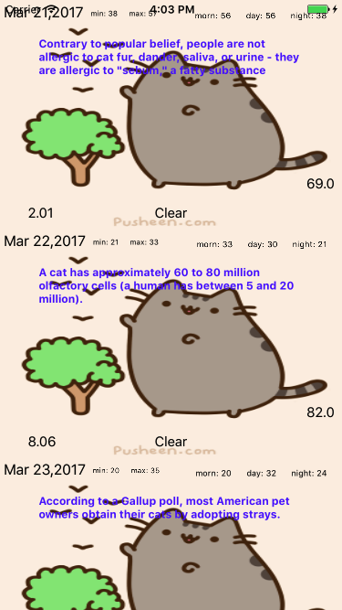

# WeatherApp

An app that gives you the five day forecast and comforts you with pusheen and cat facts :) 

1. Accesses [openWeatherMaps API's 5 day forecast](https://openweathermap.org/forecast5).
2. Accesses the [CatFacts API](https://catfacts-api.appspot.com/doc.html).
3. Uses iOS standard Model-View-Controller architecture.

Currently doesn't support error-handling ([issue](https://github.com/bereket6725/WeatherApp/issues/2)), the user interface leaves a little to be desired :smile:

## License

Code is released under MIT.
